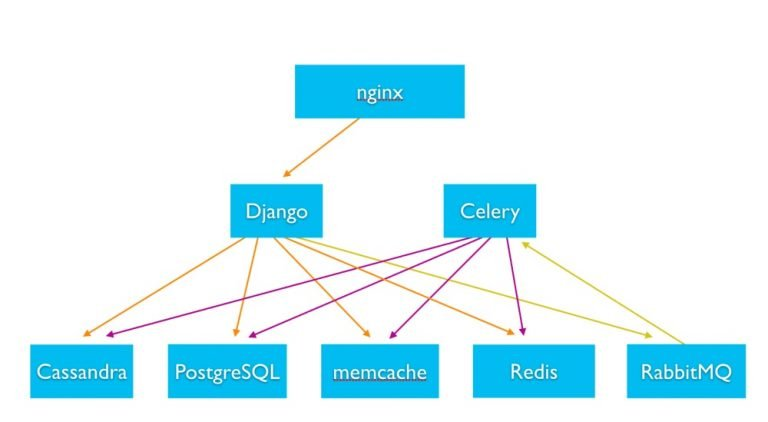

# System Design of Popular Applications and Services

The following document consists of the system design and architecture of the highly scaled and efficiently managed systems which provide services to the millions of people in the form of applications and softwares to the people in  various continents all over the world. This study would help us understand  the underlying architecture and help us gain knowledge in the field of system design.

# 1. Netflix System Design

Netflix system design is one of the most impressive system design. Netflix caters to billions of people globally online video content in the form of movies,web-series,etc to stream without any interuptions and provide a great user experience to all the people.

**Some impressive Netflix statistics for 2017.**

- Netflix has more than 110 million subscribers and increasing each passing day.
- Netflix operates in more than 200 countries. 
- Netflix has nearly $3 billion in revenue per quarter.
- Netflix adds more than 5 million new subscribers per quarter.
- Netflix plays more than 1 billion hours of video each week. As a comparison, YouTube streams 1 billion hours of video every day while  Facebook streams 110 million hours of video every day.
- Netflix played 250 million hours of video on a single day in 2017.
- Netflix accounts for over 37% of peak internet traffic in the United States

Main System Design of Netflix
Netflix operates in two clouds: 

**AWS and Open Connect.**

Both clouds must work together seamlessly to deliver endless hours of customer-pleasing video.

The three parts of Netflix:

- **Client** 
- **Backend**
- **Content delivery network (CDN).**

he client is the user interface on any device used to browse and play Netflix videos. It could be an app on your iPhone, a website on your desktop computer, or even an app on your Smart TV. Netflix controls each and every client for each and every device. 

Everything that happens before you hit play happens in the backend, which runs in AWS. That includes things like preparing all new incoming video and handling requests from all apps, websites, TVs, and other devices.

Everything that happens after you hit play is handled by Open Connect. Open Connect is Netflix’s custom global content delivery network (CDN). Open Connect stores Netflix video in different locations throughout the world. When you press play the video streams from Open Connect, into your device, and is displayed by the client. Don’t worry; we’ll talk more about what a CDN is a little later.

**USP of Netflix is Relaibility.**

Netflix is so reliable now because they’ve taken extraordinary steps to make their service reliable. 

Netflix operates out of three AWS regions: one in North Virginia, one in Portland Oregon, and one in Dublin Ireland. Within each region, Netflix operates in three different availability zones.

Netflix has said there are no plans to operate out of more regions. It’s very expensive and complicated to add new regions. Most companies operate out of just one region, let alone two or three. 

The advantage of having three regions is that any one region can fail, and the other regions will step in handle all the members in the failed region. When a region fails, Netflix calls this evacuating a region.

**Netflix runs monthly tests. Every month Netflix causes a region to fail on purpose just to make sure its system can handle region level failures. A region can be evacuated in six minutes.**

# What Happens in AWS Before you Press Play?

Anything that doesn’t involve serving video is handled in AWS. 

This includes scalable computing, scalable storage, business logic, scalable distributed databases, big data processing and analytics, recommendations, transcoding, and hundreds of other functions. 

**Scalable computing and scalable storage.**

Scalable computing is EC2 and scalable storage is S3.

**Scalable distributed database.** 

Netflix uses both DynamoDB and Cassandra for their distributed databases.

**Big data processing and analytics.**

Big data simply means there’s a lot of data. Netflix collects a lot of information. Netflix knows what everyone has watched when they watched it and where they were when they watched. Netflix knows which videos members have looked at but decided not to watch. Netflix knows how many times each video has been watched…and a lot more. 

**Netflix personalizes artwork just for you.**

When browsing around looking for something to watch on Netflix, have you noticed there’s always an image displayed for each video? That’s called the header image.

The header image is meant to intrigue you, to draw you into selecting a video. The idea is the more compelling the header image, the more likely you are to watch a video. And the more videos you watch, the less likely you are to unsubscribe from Netflix.

Let’s say one of your recommendations is the movie Good Will Hunting. Netflix must choose a header image to show you. The goal is to show an image that lets you know about a movie you’ll probably be interested in. Which image should Netflix show you? 

If you like comedies, Netflix will show you an image featuring Robin Williams. If you prefer romantic movies, Netflix will show you an image Matt Damon and Minnie Driver poised for a kiss.

**Recommendations.**

That’s part of the big data processing and analytics we just talked about. Netflix looks at its data and predicts what you’ll like. In fact, everything you see see on a Netflix screen was chosen specifically for you using machine learning.

# 2. URL Shortner

URL shortening is used to create shorter aliases for long URLs. 
URL shortening is used for optimizing links across devices, tracking individual links to analyze audience and campaign performance, and hiding affiliated original URLs.(Eg : tinyurl.com)

**Capacity Estimation and Constraints**

Traffic Estimates : 
  Assuming, we will have 500M new URL shortenings per month, with 100:1 read/write ratio.
  New URLs shortenings per second = 500M/(30 * 24 * 60 *60) = 200URLs/sec.
  Redirections / sec = 100 * 200 URLs/sec = 20K/sec
Storage Estimates :
  Assuming 5 years span .
  Total objects to store = 500M * 5yr * 12months = 30B.
  Assuming 500 bytes per object
  Total Storage = 30B * 500 = 15TB
Bandwidth Estimates : 
  For write requests : 200 * 500 = 100KB/s
  For read requests : 20K * 500 = 10MB/s
Memory Estimates :
  Will follow 20-20 rule.
  Requests per day = 20K * 60 * 60 *24 = 1.7B
  To Cache 20% of these we need 0.2 * 1.7B * 500 = 170GB.

**System API's**
createURL(api_dev_key, original_url, custom_alias=None, user_name=None, expire_date=None)
deleteURL(api_dev_key, url_key)
To prevent abuse :  Each api_dev_key can be limited to a certain number of URL creations and redirections per some time period.

**Database Schema**
URL :  Hash,OriginalURL,CreationDate,ExpirationDate,UserID
User : UserID,Name,...

**Basic System Design and Algorithm**

1.Encoding Actual URL : 
  In this we will compute an unique hash of the url and then encoded for displaying.
  If Base64 encoding is used with 6 letter key,we will have 64^7=68.7B unique .This will suffice.
  But the problems with this approach are :
    1. If multiple users enter the same URL, they can get the same shortened URL, which is not acceptable.
    2. What if parts of the URL are URL-encoded?

2.Generating keys offline : 
  We can have a standalone Key Generation Service (KGS) that generates random six-letter strings beforehand and stores them in a database (let’s call it key-DB). Whenever we want to shorten a URL, we will just take one of the already-generated keys and use it.
  Can concurrency cause problems?Servers can use KGS to read/mark keys in the database. KGS can use two tables to store keys: one for keys that are not used yet, and one for all the used keys. As soon as KGS gives keys to one of the servers, it can move them to the used keys table. KGS can always keep some keys in memory so that it can quickly provide them whenever a server needs them.
  we can have a standby replica of KGS to avoid SPF.
  
**Data Partitioning and Replication**
  We can use consistent hashing.

We can add a Load balancing layer at three places in our system:

Between Clients and Application servers
Between Application Servers and database servers
Between Application Servers and Cache servers

A separate Cleanup service can run periodically to remove expired links from our storage and cache. This service should be very lightweight and can be scheduled to run only when the user traffic is expected to be low.

# 3. Instagram

Instagram is the most popular media sharing application. It is the top choice for businesses to market their products. There are many features which make this social media platform attractive.

**Statistics**
- More than 1 billion active users
- Every day, Instagram has about 95 million photos and videos shared
- 500 million daily Instagram Stories users
- Instagram clocks up 3.5 billion likes every day
- 2 million advertisers use Instagram on a monthly basis

The statistics show that Instagram faces huge amount of traffic everyday. With posts, stories, videos how does it keep up with the traffic? 

Usage of different databases for, reliable cloud services makes it possible

The below diagram shows the architecture of Instagram

The server-side code is powered by Django Python. All the web & async servers run in a distributed environment & are stateless. The backend uses various storage technologies such as Cassandra, PostgreSQL, Memcache, Redis to serve personalized content to the users. Everytime a user uploads a photo, the post is stored in byte form in database. This process happens synchronously. 

Instagram previously used AWS services most of which has been moved to Facebook’s infrastructure. It has expanded its infrastructure from one to three data centers to scale the infrastructure geographically so that it can provide reliable service.

**News Feed**

The main component of Instagram is its news feed. News feed is personalised for each user. It is very important for the feed to load quickly. To avoid delay in loading feed it is pre-computed. The feed is pre-computed for the users by fetching data after the uploads done by users. Data fetching service is different for celebrity users and non-celebrity users.

**Different approaches for fetching news feed contents for users**

1. Pull: Clients can pull the News Feed contents from the server on a regular basis or manually whenever they need it. Possible problems with this approach are a) New data might not be shown to the users until clients issue a pull request b) Most of the time pull requests will result in an empty response if there is no new data.

2. Push: Servers can push new data to the users as soon as it is available. To efficiently manage this, users have to maintain a Long Poll request (the server holds the request open and waits for response information to become available) with the server for receiving the updates. A possible problem with this approach is, a user who follows a lot of people or a celebrity user who has millions of followers; in this case, the server has to push updates quite frequently.

3. Hybrid: We can adopt a hybrid approach. We can move all the users who have a high number of follows to a pull-based model and only push data to those users who have a few hundred (or thousand) follows. Another approach could be that the server pushes updates to all the users not more than a certain frequency, letting users with a lot of follows/updates to regularly pull data.

**Other Features**

Instagram also has features like likes, comments. This data is stored in a graph-based database, Neo4j. The graph based structure provides fast and easy access to likes and comments. It makes it easy to compute the number of likes and comments and to retrieve them.

Users get their personalised feed with the help of Deep Neural Networks. Features like Likes, Comments, Hashtags in the media that users like. The content that the user might like is added to their news feed and such posts are shown more frequently to the user.

